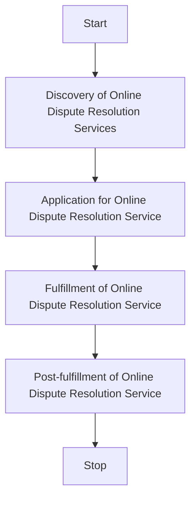
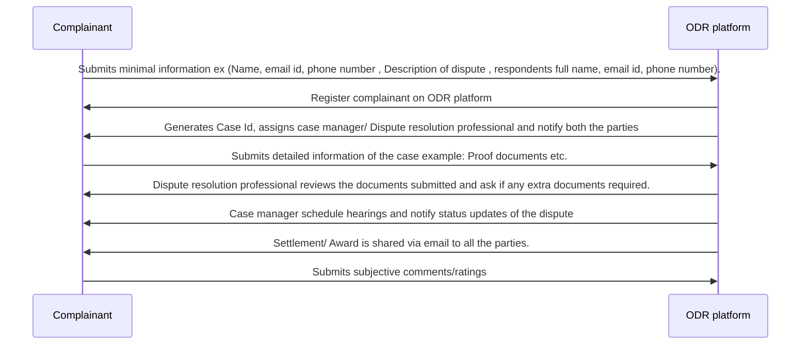

## A General Workflow for Availing Online Dispute Resolution services

### Overview

Any Online Dispute Resolution services application consists of the following flow.

Each of these steps consist of one or more interactions that allow a Online Dispute Resolution Service consumer (ODRC) to avail services offered by a Online Dispute Resolution Services Provider (ODRP). These ODR services can be anything ranging from Arbitration, Conciliation, Mediation.

A typical workflow for a Online Dispute Resolution Service transaction consits of the following steps.

1. Discovery of Online Dispute Resolution Services
2. Application for a Online Dispute Resolution Service
3. Fulfillment of the Online Dispute Resolution Service
4. Post-fulfillment of Online Dispute Resolution Service

**Step 1: Multiple web search to discover and compare ODR service providers based on the services available like mediation, conciliation, and arbitration**

- End user searches for available online dispute resolution service providers to compare different services available, their terms and conditions, cost of dispute resolution process etc.

**Step 2: Choose a suitable Online Dispute Resolution provider**

- Based on the research and needs assessment, the end user selects the most suitable online dispute resolution service provider that best matches their requirements.

**Step 3: End consumer registers and initiate the case by submitting minimal information**

- The user may directly log onto the ODR institution portal OR the user’s platform directly speaks to the ODR institution’s portal.
- The user registers on the ODR institution platform by providing their
  - Full name
  - Email ID
  - Phone number
  - Description of the dispute
  - Documents/attachments. They also provide the respondent’s (i) full name (ii) email ID (iii) phone number.
- The user consents to the terms and conditions of the ODR institution and clicks submit.
- Case ID is generated to confirm the initiation of the dispute.
- The user and the respondent\* receive a notification confirming the ODR institution received the case, along with the Case ID and next steps.

- In some instances, case managers/dispute resolution professionals are appointed at this stage who also receive the notifications.

> **Payment: ODR institutions seem to initiate payment at different stages, also contingent on the kinds of disputes. It may be initiated when the case is initiated or upon confirmation or during the resolution process or post the resolution process.**

**Step 4: ODR service provider confirms and assigns a dispute resolution professional.**

- The ODR institution/case manager/dispute resolution professional reviews and verifies the documents provided in the case.
- Upon verification, the ODR institution confirms the case and assigns a dispute resolution professional.
- Notifications are sent to the parties, the case manager, and the dispute resolution professional confirming the case & providing the next steps.
- The dispute resolution process begins.

**Step 5: Case Manager schedules the hearings**

- The end consumer submits documents necessary for the case hearings, including any additional documents related to the dispute
- The Dispute resolution professional verifies the authenticity of the submitted documents.
- The ODR institution/dispute resolution professional/case manager schedules hearings, etc.
- End consumers can track the status of their dispute on the ODR’s portal.

**Step 6: Passing an Award/Settlement**

- The award/settlement is sent to the parties and dispute resolution professionals via email.

